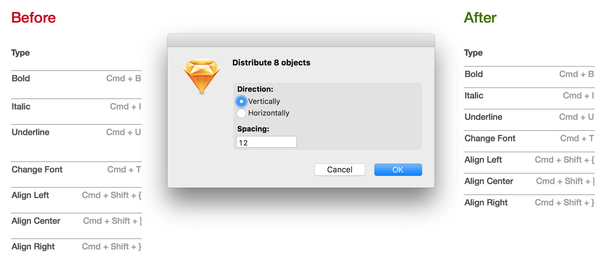
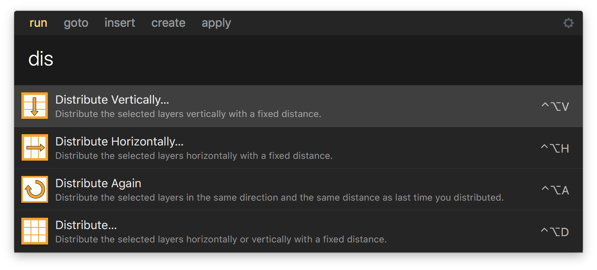

# SketchDistributor

A [Sketch](https://sketchapp.com) plugin that distributes selected objects vertically or horizontally *with a specified spacing* between objects edges or centers (as the formerly available "boxed" setting in Sketch Grid).

Like so:

## Installation

Or if you use [Runner](https://bit.ly/SketchRunnerWebsite), it can install this plugin as well.

Or, do it manually:

1. Download [this zip archive](https://github.com/PEZ/SketchDistributor/archive/master.zip)
2. Unzip
3. Double-click the `.sketchplugin` package.

## How-to

You select the objects you want to distribute, then ask Distributor to do it:

1. **Distribute Horizontally …** (<kbd>CTRL</kbd>+<kbd>OPTION</kbd>+<kbd>H</kbd>), brings up the Distributor dialog box with *horizontal* distribution preselected. You specify spacing (in pixels).
1. **Distribute Vertically …** <kbd>CTRL</kbd>+<kbd>OPTION</kbd>+<kbd>V</kbd>, same as above for *vertical* distribution.
1. **Distribute again** (<kbd>CTRL</kbd>+<kbd>OPTION</kbd>+<kbd>A</kbd>) applies the last used distribution settings on the selected objects.
1. **Distribute …** (<kbd>CTRL</kbd>+<kbd>OPTION</kbd>+<kbd>D</kbd>), same dialog box as above, remembering the last distribution direction. (Mostly here for legacy reasons.)

The distribution depicted above you get by typing <kbd>CTRL</kbd>+<kbd>OPTION</kbd>+<kbd>V</kbd>, `10`, <kbd>⮐</kbd>. Your fingers can stay on the keyboard.

Note that you can use negative spacing to get overlap:

(<kbd>CTRL</kbd>+<kbd>OPTION</kbd>+<kbd>H</kbd>, `-14`, <kbd>⮐</kbd>)

### It Works with Runner

If you are using the amazing [Runner](https://bit.ly/SketchRunnerWebsite) plugin you can also access the Distributor commands from there:

## Bugs / Comments / Questions / Suggestions

Is the plugin misbehaving? File an issue. Have a suggestion? File an issue. You can pretty much file an issue for whatever reason. Please include the version of the plugin you are using if you think it could be relevant (it most often is). There is also Twitter [@PappaPEZ](https://twitter.com/pappapez)

### Known Issues

The plugin can't help with distributing rotated layers correctly. See issue #10. Also some shapes have a strange bounding rectangle according to Sketch. That makes them distribute less perfectly especially in vertical direction. Hoping for the Sketch API to soon make it possible to handle both these cases.

## Sketch Community Attention

This little plugin is surprisingly often present in various **Top X Sketch Productivity plugins** articles. Too many to list here, but here are a few that got me smiling and almost bursting:

* It makes it into Mochplus' [10 Best Sketch Plugins for UX/UI Designers in 2018](https://www.mockplus.com/blog/post/best-sketch-plugins-for-ui-ux-designers)
* SketchDistributor snatches the #1 spot in [The ultimate Sketch plugins list for productivity in 2017](https://blog.prototypr.io/the-ultimate-list-that-you-need-of-plugins-for-sketch-fb59d4dedb87#.h0ya2d8ib) by Andrea Pacheco.
* It is mentioned as a valuable tool in Yaroslav Zubko's excellent piece, [A Practical Guide To Convert Your Sketches To Working Prototypes](https://stories.uplabs.com/a-practical-guide-to-convert-your-sketches-to-working-prototypes-5b1a732d1eb5#.t5cry3g8x).
* [LevelUpTuts](https://www.youtube.com/channel/UCyU5wkjgQYGRB0hIHMwm2Sg) made a video showing how SketchDistributor can [improve the workflow](https://www.youtube.com/watch?v=BzZKMQe1qQk). (The plugin is a few steps improved on the workflow support since.)
